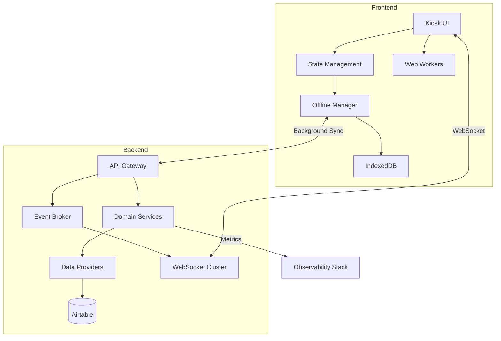
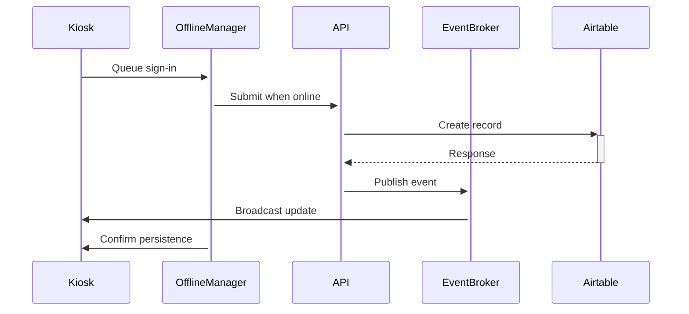
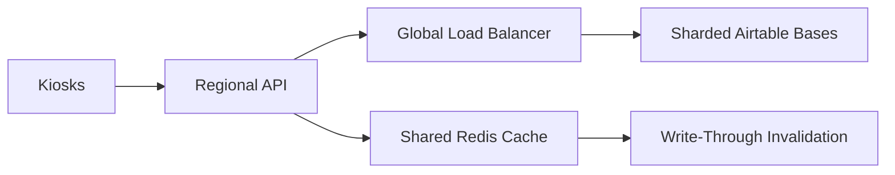

# The Curious Forge Kiosk Architecture


## Core Principles

1. **Offline-First**

   - All write operations queue locally first
   - Background sync via service workers
   - Conflict resolution using CRDTs

2. **Real-Time Responsiveness**

   - Event-driven architecture with Socket.IO
   - Prioritized event bus for critical operations
   - Client-side optimistic updates

3. **Vendor Agnostic Core**

   - Abstracted data layer with `DataProvider` interface
   - Airtable implementation as one concrete provider
   - Future-proofed for alternative backends

4. **Cross-Cutting Concerns**
   - Centralized observability (logging/metrics/tracing)
   - Feature flagging system
   - Automated audit trails

## High-Level Component Diagram



## Enhanced Data Flows

### Optimized Sign-In Process



## Key Architecture Decisions

1. **State Management Strategy**

   - Unified store architecture using custom Svelte stores
   - Lazy hydration of non-critical data
   - Automatic version migration

2. **Real-Time Event Priorities**

```ts
enum EventPriority {
  CRITICAL = 0, // Sign-in/out
  HIGH = 1, // Safety alerts
  NORMAL = 2, // Kudos/messages
  BACKGROUND = 3, // Analytics
}
```

3. **Caching Strategy**
   - Redis-backed query cache (15s TTL)
   - Stale-while-revalidate for common queries
   - Cache invalidation via WebSocket events

## Failure Modes & Recovery

| Scenario             | Detection            | Recovery Strategy             |
| -------------------- | -------------------- | ----------------------------- |
| Airtable outage      | Health checks        | Failover to local cache       |
| WebSocket disconnect | Heartbeat monitoring | Exponential backoff reconnect |
| Sync conflicts       | Version vectors      | Last-write-wins + audit log   |
| Memory pressure      | Resource monitoring  | Selective data purging        |

## Scaling Strategy



## Frontend Architecture Patterns

### Store Architecture

```ts
// Base store interface
interface Store<T> {
  get(id: string): Promise<T>;
  getAll(filter?: Partial<T>): Promise<T[]>;
  subscribe(callback: (data: T[]) => void): () => void;
  invalidate(): void;
}

// Domain store implementation
class MemberStore implements Store<Member> {
  private cache = new LRU<string, Member>(1000);
  private subscribers = new Set<Function>();

  constructor(private api: MemberAPI) {}

  async get(id: string) {
    if (this.cache.has(id)) return this.cache.get(id);
    const member = await this.api.fetchMember(id);
    this.cache.set(id, member);
    return member;
  }

  // ...other implementations
}

// Factory pattern
export function createDomainStore<T>(config: {
  name: string;
  api: DomainAPI<T>;
  cacheSize?: number;
}): Store<T> {
  return new GenericDomainStore(config);
}
```

### Component Composition Strategy

```svelte
<script>
  // Feature-flagged component
  import FeatureFlag from '$lib/components/FeatureFlag.svelte';
  import { featureFlags } from '$lib/config';
</script>

<FeatureFlag flag={featureFlags.KUDOS_V2}>
  <GiveKudosModal {member} />
</FeatureFlag>
```

## Components

1. **Frontend (SvelteKit)**

   - Houses the main kiosk UI:
     - Home screen (Kudos feed, Signed-in list, Notifications banner).
     - Dashboard modals for sign-in/out, stats, messages, etc.
     - Offline logic with IndexedDB.
   - Uses WebSockets for instant updates from the Node server.

2. **Backend (Node.js + Express + Socket.IO)**

   - All kiosk requests go through these endpoints.
   - Hides Airtable API keys and logic behind an internal layer.
   - Maintains a WebSocket channel for real-time broadcast of events:
     - signIn, signOut, kudosSent, messageSent, etc.

3. **Airtable**
   - Stores all records:
     - Members (mastersheet), Member Types, Signed In, Use Log, Activity Log, Kudos, and more.
   - The Node back-end reads/writes using the Airtable REST API or official client library.

## Data Flows

### 1. Sign In

1. SvelteKit kiosk → `POST /api/signIn` with { memberId, memberType }.
2. Node server → create record in “Signed In” table → returns success.
3. Node server → `io.emit('signIn', { memberId, ... })`.
4. All kiosks → update UI: add the user to the “signed in” list.

### 2. Sign Out

1. SvelteKit kiosk → user selects activities/slider → `POST /api/signOut`.
2. Node server → removes from “Signed In” table → creates “Use Log” + “Activity Log” records → returns success.
3. Node server → `io.emit('signOut', { memberId, ... })`.
4. All kiosks → remove user from “signed in” list.

### 3. Kudos

1. Kiosk → `POST /api/kudos` (From, To[], Message).
2. Node server → creates record in “Kudos” table → returns success.
3. Node server → `io.emit('kudosSent', { kudosId, from, to, message })`.
4. All kiosks → update Kudos feed.

### 4. Messages (To the Office)

1. Kiosk → `POST /api/message` (message text, memberId if known).
2. Node server → creates record in “Received Sign In App Messages” → returns success.
3. Node server → `io.emit('officeMessageSent', { messageId, ... })` (optional).

### 5. Offline Handling

- If kiosk is offline, the request is stored in an IndexedDB **outbox**.
- On reconnect, outbox is processed in background → Node server → Airtable → WebSocket broadcast.

## Real-Time Updates

- **Socket.IO** is used for a push-based model.
- Kiosks subscribe to events:
  - `signIn`, `signOut`, `kudosSent`, `messageSent`, etc.
- On receiving an event, kiosk fetches updated records from Node or directly updates local data if event payload is sufficient.

## Polling / Airtable Webhooks

- Node server may also poll Airtable or use a webhook to detect changes made directly in Airtable.
- On detection, Node server broadcasts the updated record to kiosks.

## Scaling

- **Multiple Kiosks**: Each kiosk connects to the same Node server, shares real-time updates.
- **Node server** can be load-balanced with sticky sessions if needed for Socket.IO.
- **Airtable** handles up to the base record limit
